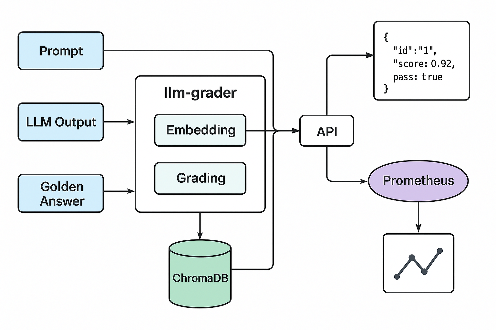

# 🧠 llm-grader

**llm-grader** is an evaluation tool designed to assess the accuracy and quality of responses generated by Large Language Models (LLMs). It compares LLM outputs to predefined golden answers using embedding similarity, exposes metrics via Prometheus, and optionally stores historical evaluation data in ChromaDB.


---
</img>
---

## 🚀 Features

- ✅ Evaluate LLM responses against golden answers
- 📐 Cosine similarity-based grading using embeddings
- 📊 Prometheus integration for real-time monitoring
- 🧲 ChromaDB support for vector-based logging and retrieval
- 🔌 RESTful API built with FastAPI
- 🧪 Built-in schema validation

---

## 📦 Installation

### 1. Clone the repository

```bash
git clone https://github.com/WoodProgrammer/llm-grader.git
cd llm-grader
pip3 install -r requirements.txt
```

and run

```bash
uvicorn app.main:app --reload
```

## API Usage

This project contains three important endpoint at the end

### Embed your golden answers
```sh
POST /api/v1/embed_structured_golden_answers
Evaluates a batch of prompts with golden answers using embeddings.
```

```json
{
  "data": [
    {
      "id": "1",
      "prompt": "What is the capital of France?",
      "golden_answer": "Paris"
    }
  ]
}
```

```json
[
  {
    "id": "1",
    "score": 0.982,
    "pass": true
  }
]
```

### Send your llm responses by ID

```sh
POST /api/v1/answers
This endpoint basically save all the responses by the ID. Id is the important part. It basically saves your llm outputs.
```

```json
{"id": "q1", "llm_output": "ATATÜRK, Modern Türk Cumhuriyeti'nin kurucusudur."}
```


### Prometheus Metrics
A /metrics endpoint is exposed for Prometheus scraping. Sample metrics:

```sh
llm_grade_score{}
llm_grade_count{}
```

You can use Grafana to visualize pass/fail counts, score distributions, and monitor LLM quality trends over time.

## Contributing
Contributions are welcome! Please open an issue or submit a PR if you’d like to improve the tool or add new features.